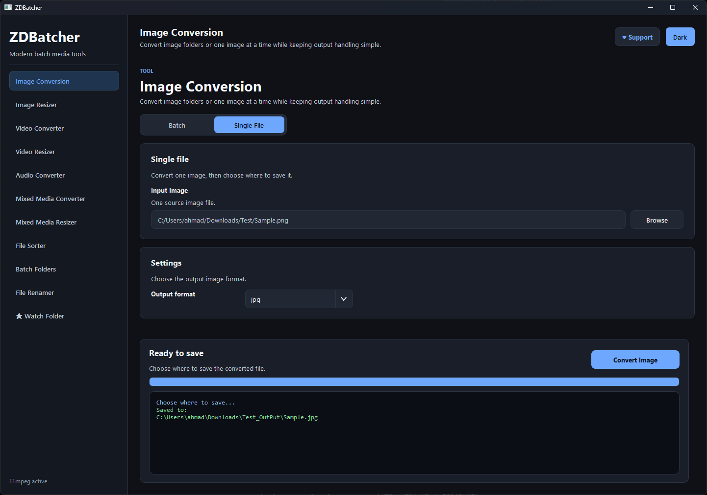
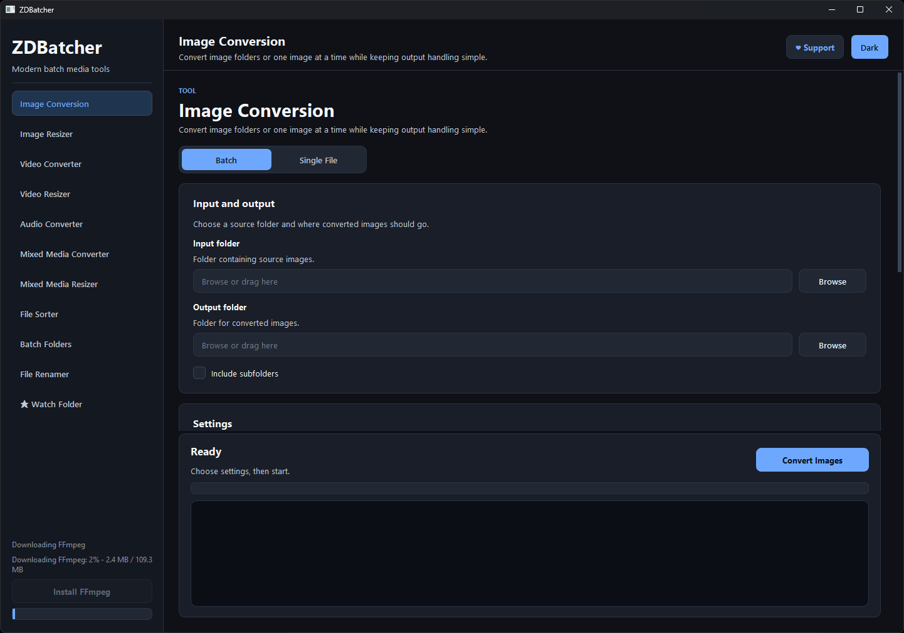

# ZDBatcher

ZDBatcher is a Windows desktop batch media automation tool for repetitive image, video, and audio workflows. It combines conversion, resizing, compression, renaming, sorting, batch folder creation, mixed media tools, and watch-folder automation in one PySide6 app.





## Status

Usable. Core workflows are stable. A few edge cases are still being ironed out; see Known Limitations.

This project is built as a practical Windows desktop utility and a public portfolio project.

## Features

- Image conversion across common formats, including JPG, PNG, WebP, AVIF, SVG, HEIC, BMP, and TIFF
- Image resizing and compression
- Video conversion with FFmpeg
- Video resizing and compression
- Audio conversion and audio extraction from video
- Mixed media conversion and resizing
- File sorting into organized folder structures
- Batch folder creation by file count or folder size
- File renaming with prefixes, numbering, padding, and sort options
- Watch-folder automation for processing newly added files
- Local in-app FFmpeg installer with real download progress

## Requirements

- Windows
- Python 3.11 or 3.12 recommended
- Python 3.13+ may work, but 3.11/3.12 are safer for setup and dependency compatibility
- Dependencies from `requirements.txt`
- FFmpeg and FFprobe for video, audio, and mixed media workflows

FFmpeg is not required for image-only tools.

## Quick Start

```powershell
python -m venv .venv
.\.venv\Scripts\Activate.ps1
pip install -r requirements.txt
python -m app.main
```

## FFmpeg Setup

FFmpeg is required for video, audio, and mixed media workflows. FFmpeg binaries are not included in this repository.

ZDBatcher detects FFmpeg from:

1. Local `tools/ffmpeg/`
2. System `PATH`

You can install FFmpeg locally in either of these ways:

1. Click the in-app **Install FFmpeg** button when FFmpeg is missing.
2. Run the installer script:

```powershell
.\scripts\install_ffmpeg.ps1
```

Both install methods download `ffmpeg.exe` and `ffprobe.exe` into `tools/ffmpeg/`. The in-app installer shows real download progress with percentage and MB count when the server provides the archive size.

The installer:

- Does not require admin permissions
- Does not install FFmpeg system-wide
- Does not modify `PATH`
- Keeps FFmpeg local to the project folder

`tools/ffmpeg/*.exe` is ignored by Git so the public repository does not include FFmpeg binaries.

## How to Use

1. Launch the app with `python -m app.main`.
2. If FFmpeg is missing and you need media tools, click **Install FFmpeg** in the sidebar or run the script above.
3. Select a tool from the sidebar.
4. Choose input files or folders.
5. Choose an output folder.
6. Configure format, quality, resize, sorting, renaming, or batch settings.
7. Start the operation and monitor progress in the bottom panel.

Watch Folder mode monitors a folder and automatically processes new files based on the selected rules. Use it carefully because it runs continuously until stopped.

## Example Test

Basic validation commands:

```powershell
python -m compileall app
python -c "from app.ui.main_window import ImageConverterApp; print('OK')"
python -m app.main
```

## Project Structure

```text
app/
  core/                 Core conversion, resizing, sorting, renaming, batching, watch-folder, and FFmpeg installer logic
  ui/                   PySide6 desktop UI
  main.py               App entry point

assets/                 README screenshots and lightweight project images
scripts/
  install_ffmpeg.ps1    Optional local FFmpeg installer

tools/
  ffmpeg/               Local FFmpeg install target; executable files are ignored by Git

requirements.txt        Python dependencies
README.md               Project overview and setup guide
```

## Known Limitations

- Built and tested primarily on Windows
- Video, audio, and mixed media workflows require either local FFmpeg or FFmpeg on `PATH`
- Watch-folder automation should be used carefully because it processes files automatically

## Planned Improvements

- More automated test coverage for core workflows
- Cleaner packaging and release builds
- More conversion presets and quality controls
- Better progress reporting for long media operations
- Stronger watch-folder safeguards and queue controls
- More detailed error messages for unsupported or damaged media files

## Notes for Reviewers

- The repository intentionally does not include `ffmpeg.exe` or `ffprobe.exe`.
- Use the in-app **Install FFmpeg** button or run `.\scripts\install_ffmpeg.ps1` to install FFmpeg locally.
- Local FFmpeg files are installed under `tools/ffmpeg/` and ignored by Git.
- The app checks local `tools/ffmpeg/` first, then falls back to system `PATH`.
- No admin permissions are required for the local FFmpeg install.
- The app can be run directly with `python -m app.main` after installing dependencies.
